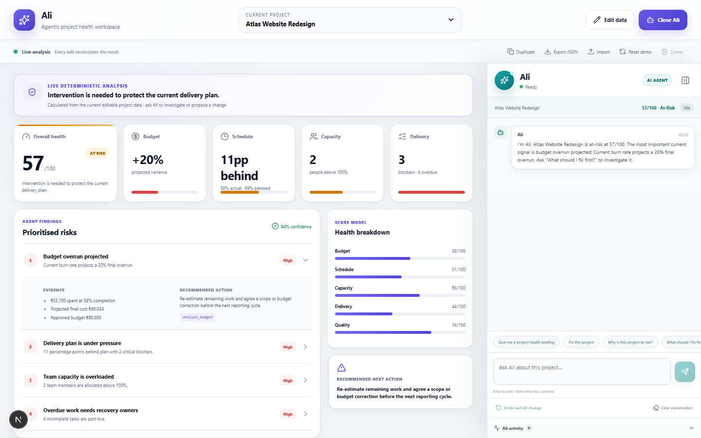
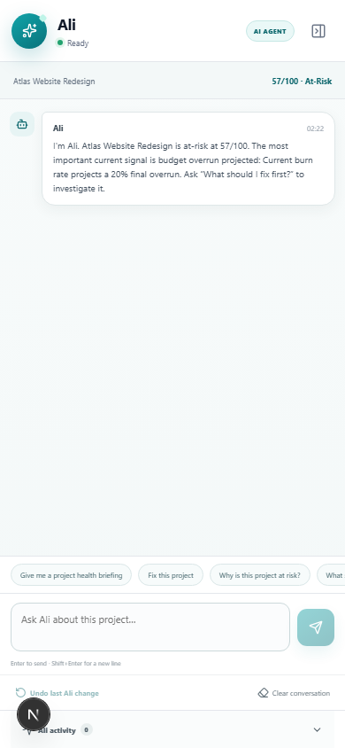

# Ali · Project Health Agent

Ali is a working agentic project-health prototype built around an editable browser-local dashboard. It is not a Scoro integration and does not copy Scoro ELI branding or product behavior.

Ali can inspect the selected project's live data, choose typed tools, explain evidence, ask for missing information, create a project-version-bound proposal, simulate it on a deep copy, require approval, apply the approved change, rerun health analysis, verify the result, and undo through a per-project snapshot stack.

Ali is explicitly multi-turn. Every project keeps its own conversation phase, current goal, findings, pending clarification, selected options, pending plan/proposal, last applied proposal, tool traces, messages, activity, and undo history. Short replies such as “the first option” are resolved against this stored state rather than reconstructed from a single prompt.

The existing dashboard remains intact: project switching, creation, duplication, manual editing, deterministic analysis, localStorage persistence, and JSON import/export continue to work.

## Product preview

<table>
  <tr>
    <th>Desktop workspace</th>
    <th>Mobile agent</th>
  </tr>
  <tr>
    <td width="72%"></td>
    <td width="28%"></td>
  </tr>
</table>

## Modes

Without credentials, **Local demo agent** uses a deterministic natural-language router. It extracts live task/person/date/percentage/status references and calls the same pure tools and proposal machinery as model mode. It is not an LLM.

When both `OPENAI_API_KEY` and `OPENAI_MODEL` are configured, **AI agent** uses a real OpenAI Responses API tool-calling loop. The model selects read/proposal tools and writes explanations. Application code owns calculations, validation, simulation, approval, mutation, and undo. Runs are limited to eight tool calls and 20 seconds per model request; invalid output, invalid tools, timeouts, and API errors fall back to the local agent with disclosure.

The API key stays server-side and is never placed in a `NEXT_PUBLIC_` variable.

## Supported commands

Investigation:

- Project briefing, health-score explanation, highest-priority risk, or a specific risk.
- Budget, schedule, capacity, blockers, overdue work, quality, and critical-task investigation.
- Prioritised recovery plan with a non-guaranteed forecast.

Approval-gated actions:

- Reforecast or update the approved budget; record revised actual progress.
- Create an estimate-validation checklist.
- Defer non-critical scope or restore a deferred task.
- Mark a task done, in progress, blocked, deferred, or restored. Blocked status requires a reason.
- Resolve a blocker by returning the task to in progress and clearing blocker detail.
- Change a task due date, owner, estimate, or critical-path flag.
- Create a follow-up task with explicit existing owner, due date, and estimate.
- Permanently delete an exact task through a visually distinct approval card.
- Increase/reduce one allocation or rebalance two existing team members using recorded capacity.
- Reassign a task to an existing team member.
- Move a project or task deadline. Ali explains that moving dates is a planning decision, not a fix by itself.

Conversation controls:

- Approve, reject, undo, clear conversation, reassess, and explain capabilities.
- Contextual phrases such as “approve it”, “go ahead”, “yes”, “do that”, “reject it”, and “undo that”.
- “Use the first option” and “use the second option” resolve against the latest clarification card.
- Ambiguous duplicate names or similar task references produce explicit option buttons.

## Safety boundary

```text
request → live read tools → evidence → structured proposal → deep-copy simulation
        → version check → explicit approval → central applyProposal
        → analysis rerun → verification → persisted undo stack
```

- Proposal tools never mutate data and the model has no direct mutation tool.
- Every proposal stores `projectId` and `projectUpdatedAtAtCreation`.
- A proposal becomes stale when manual data changes; stale approval is disabled until reassessment.
- Duplicate approval, wrong-project approval, missing IDs, invalid dates, invalid status transitions, negative financials, progress outside 0–100, and allocations outside 0–200 are rejected.
- Reassigned and newly created task owners must already exist on the project team.
- Simulation uses a deep copy. It is shown as a forecast, never a promise. Non-scoreable planning changes show `afterScore: null` with an explanation.
- Reject never calls the apply path.
- `applyProposal` and `undoProposal` are central pure functions. Undo refuses to erase manual edits made after Ali's action.
- Conversation, activity, pending state, and undo stacks are persisted separately by project.
- Imported project data is normalized so empty/missing task and team lists, zero budget/progress, missing dates, and malformed numeric values do not crash Ali.

## Conversation state machine

```text
IDLE → INVESTIGATING → NEEDS_CLARIFICATION → PLANNING
     → AWAITING_CONFIRMATION → EXECUTING → VERIFYING → IDLE
                                      ↘ ERROR
```

- Clarification questions and button options are persisted and also accept typed replies.
- A selected answer is combined with the prior goal and live project data to create a simulated plan.
- Confirmation cards expose every change and offer **Approve plan**, **Reject plan**, and **Modify plan**.
- Approval uses a central stepwise executor. Each visible progress update corresponds to a real project-state operation; there are no artificial delays.
- Verification reruns deterministic analysis and records score/risk differences before returning to `IDLE`.

## Run locally

Requires Node.js 20.19 or newer.

```bash
npm install
npm run dev
```

Open [http://localhost:3000](http://localhost:3000).

Optional model mode:

```bash
copy .env.example .env.local
```

```env
OPENAI_API_KEY=your_server_side_key
OPENAI_MODEL=your_responses_api_model
```

Restart the development server after configuring the environment.

## Verification

```bash
npm run lint
npm run build
npm run test:capabilities
npm run test:smoke
npm run test:e2e
```

`test:capabilities` directly loads the TypeScript proposal/local-agent code and verifies the multi-turn scenarios A–E, versioning, no pre-approval mutation, stepwise apply, exact undo, stale rejection, duplicate approval rejection, deferral, task transfer/rebalance, invalid dates, duplicate-name clarification, project isolation, fallback disclosure, real trace results, and malformed/empty project normalization.

`test:smoke` starts the production server and exercises the live `/api/agent` endpoint for multi-turn clarification/planning, investigation, budget reforecast, scope strategy, task ownership/allocation transfer, task status, follow-up task creation, checklist creation, deadline change, and recovery-plan simulation.

`test:e2e` starts an isolated local-mode server and uses Playwright with Chromium to verify the browser UI. It covers evidence-backed investigation, approval-gated mutation, verification, exact undo, and the full-screen mobile agent flow. Install the browser once with `npx playwright install chromium`.

## Five-minute demo

1. Open unhealthy **Atlas Website Redesign**.
2. Ask **“Why is this project at risk?”** and expand real tool inputs/results plus evidence.
3. Ask **“What should I fix first?”**
4. Ask **“Reforecast the budget.”** Show that the proposal is version-bound and does not claim cost reduction.
5. Reject it and show that data is unchanged.
6. Ask **“Create a recovery plan.”** Review individual changes and forecast caveat.
7. Approve Mia's allocation change. Show dashboard/team data updating and Ali's verification.
8. Edit project data manually; show the stale proposal state and **Reassess project** control.
9. Open **Ali activity**, then click **Undo last Ali change** to restore the exact prior snapshot.
10. Switch projects and back to demonstrate isolated conversations and undo stacks.

## Architecture

- `lib/analyze.ts` — deterministic score, findings, evidence, and recommendations.
- `lib/project-data.ts` — safe import/localStorage project normalization.
- `lib/agent/types.ts` — response, trace, proposal, simulation, activity, and undo schemas.
- `lib/agent/tools.ts` — pure live read tools and proposal-creation tools.
- `lib/agent/proposals.ts` — validation, version checks, simulation, central apply, comparison, and central undo.
- `lib/agent/local-agent.ts` — deterministic natural-language and contextual routing.
- `lib/agent/model-agent.ts` — server-only Responses API loop and tool orchestration.
- `app/api/agent/route.ts` — request validation, mode selection, and safe fallback.
- `components/ali/*` — chat, traces, evidence, clarifications, proposals, stale states, activity, and responsive drawer.

## Known limitations

- Local mode recognizes the documented capability set but is not open-ended language understanding; unusual phrasing may require clarification.
- Health forecasts use the existing deterministic score and available task hours. They are decision support, not delivery guarantees.
- Rebalancing changes recorded project allocations; it does not integrate with an external resource-planning system.
- Browser-local persistence has no authentication, shared backend, cross-device sync, or enterprise audit export.
- Undo is safe and multi-level for consecutive Ali actions, but it stops if a later manual edit would be overwritten.
- Model responses are request/response rather than token-streamed.
